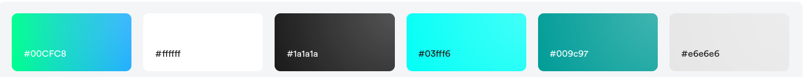
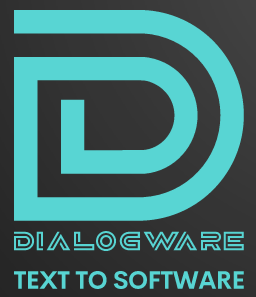

# [logo.dialogware.com](https://logo.dialogware.com/) 

## Font

font name: Titillium-Bold
font link: https://www.fontsquirrel.com/fonts/titillium
font author: Accademia di Belle Arti Urbino
font author site: http://www.accademiadiurbino.it/

icon designer: Andrejs Kirma
icon designer link: /andrejs
    
    
    fontColor: {"gradient-0":"#00D2FF","gradient-1":"#10DD45"}
    bgColor: {"hex":"transparent"}
    iconColor: {"gradient-0":"#00D2FF","gradient-1":"#10DD45"}

## Colors

Font 

    #00D2FF, #10DD45

Background

    transparent

Icon

    #00D2FF, #10DD45    

## 1
[https://logo.dialogware.com/1/cover.png](https://logo.dialogware.com/1/cover.png)

## 2
[https://logo.dialogware.com/2/cover.png](https://logo.dialogware.com/2/cover.png)

## 3
[https://logo.dialogware.com/3/cover.png](https://logo.dialogware.com/3/cover.png)

## 4
[https://logo.dialogware.com/4/cover.png](https://logo.dialogware.com/4/cover.png)

## 5
[https://logo.dialogware.com/5/cover.png](https://logo.dialogware.com/5/cover.png)

# DEMO

[https://logo.dialogware.com/demo/dialogware-app.png](https://logo.dialogware.com/demo/dialogware-app.png)

[https://logo.dialogware.com/demo/dialogware-visitcard.png](https://logo.dialogware.com/demo/dialogware-visitcard.png)

[https://logo.dialogware.com/demo/dialogware-web.png](https://logo.dialogware.com/demo/dialogware-web.png)

[https://logo.dialogware.com/demo/dialogware-tshirt.png](https://logo.dialogware.com/demo/dialogware-tshirt.png)

---

+ [edit](https://github.com/dialogware/logo/edit/main/README.md)
+ [dialogware/logo/](https://github.com/dialogware/logo/)
